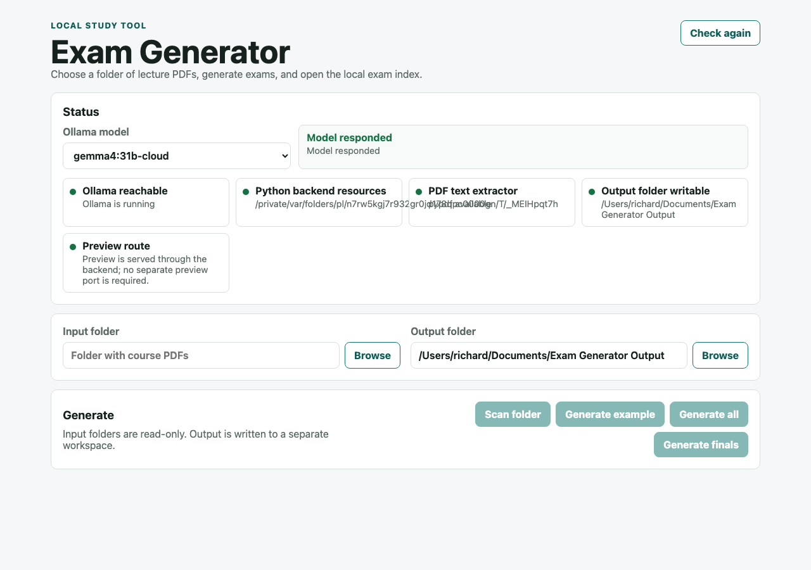
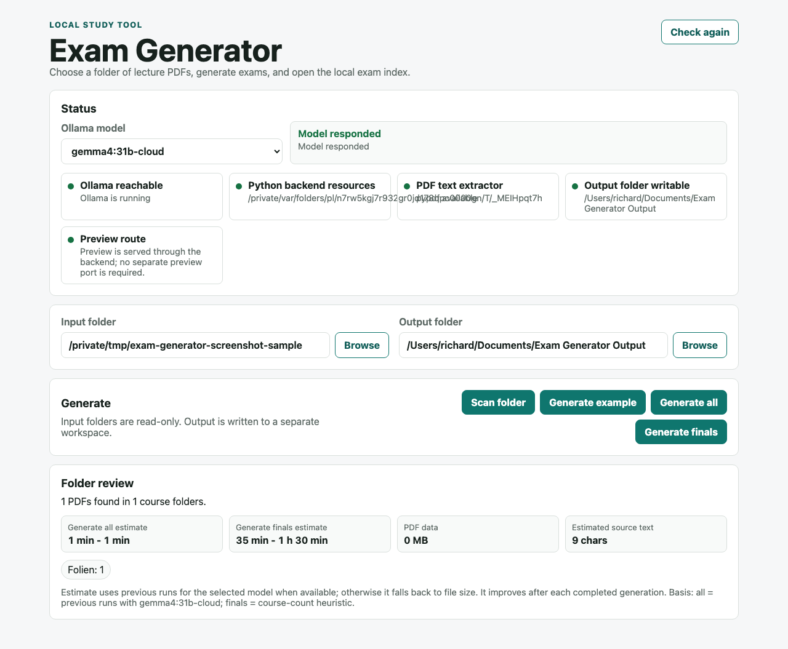

# Exam Generator Desktop

A simple local desktop app for generating study exams from university PDF folders.

The app is intentionally small: choose a folder with PDFs, choose an output folder, generate exams, and open the local exam index.

This repository is separate from the production exam workspace. Do not commit PDFs or generated exams.

## What This App Does

- Scans folders for lecture PDFs.
- Generates one example exam, all deck exams, or course final exams.
- Uses Ollama for AI question generation and open-answer grading.
- Writes generated exams into a separate output folder.
- Keeps input folders read-only.
- Shows a rough generation-time estimate after scanning a folder.

## Screenshots

Startup/status view:



Folder review after scanning PDFs:



## Current Install Status

This is currently a developer-style install from GitHub, not yet a polished one-click installer.

That means you need to install a few dependencies once:

- Git
- Python 3
- Node.js
- Rust/Tauri build tools
- Ollama
- At least one Ollama model

After setup, the app can be started from the project folder.

## Packaging Branch

The `packaging/installers` branch is separate from `main`.

Its goal is to produce normal-user installers:

- macOS `.dmg`
- Windows installer `.exe`
- bundled Python backend
- no required Node, Rust, Git, Python, or Apple Command Line Tools for normal users

The packaging test app is deliberately named:

```text
Exam Generator Packaging Test
```

This prevents it from replacing the current working `Exam Generator` app during testing.

Ollama is still external. Users must install Ollama, and the app can guide them or download the selected model once Ollama is running.

To build installers from the packaging branch:

```bash
git switch packaging/installers
cd apps/desktop
npm run tauri build
```

GitHub Actions also builds macOS and Windows artifacts when this branch is pushed.

## Mac Installation

### 1. Install Ollama

Download and install Ollama:

https://ollama.com

Open Terminal and install the default model:

```bash
ollama pull gemma4:31b-cloud
```

Check that Ollama is running:

```bash
ollama serve
```

If it says Ollama is already running, that is fine.

### 2. Install Apple Command Line Tools

```bash
xcode-select --install
```

If it says they are already installed, that is fine.

### 3. Install Python 3

Download Python 3 from:

https://www.python.org/downloads/

Then check:

```bash
python3 --version
```

### 4. Install Node.js

Download the LTS version from:

https://nodejs.org

Then check:

```bash
node --version
npm --version
```

### 5. Install Rust

Go to:

https://rustup.rs

Run the install command shown there, then restart Terminal.

Check:

```bash
cargo --version
```

### 6. Download The App

```bash
mkdir -p ~/Projects
cd ~/Projects
git clone https://github.com/Ricam1008/exam-generator-desktop.git
cd exam-generator-desktop
```

If the repository is private, the GitHub account must have access first.

### 7. Install The Python PDF Dependency

```bash
python3 -m pip install --user pypdf
```

### 8. Install App Dependencies

```bash
cd apps/desktop
npm install
```

### 9. Start The App

```bash
npm run tauri dev
```

The Exam Generator window should open.

## Windows Installation

Windows is supported by the chosen app stack, but the current setup is still more developer-style than installer-style.

### 1. Install Ollama

Download and install Ollama:

https://ollama.com

Open PowerShell and install the default model:

```powershell
ollama pull gemma4:31b-cloud
```

Check that Ollama is running:

```powershell
ollama serve
```

If it says Ollama is already running, that is fine.

### 2. Install Python

Download Python from:

https://www.python.org/downloads/windows/

During installation, enable:

```text
Add python.exe to PATH
```

Then check:

```powershell
python --version
```

### 3. Install Node.js

Download the LTS version from:

https://nodejs.org

Then check:

```powershell
node --version
npm --version
```

### 4. Install Rust

Download and run `rustup-init.exe` from:

https://rustup.rs

Restart PowerShell, then check:

```powershell
cargo --version
```

### 5. Install Git

Download Git from:

https://git-scm.com/download/win

### 6. Download The App

```powershell
cd $env:USERPROFILE
mkdir Projects
cd Projects
git clone https://github.com/Ricam1008/exam-generator-desktop.git
cd exam-generator-desktop
```

If the repository is private, the GitHub account must have access first.

### 7. Install The Python PDF Dependency

```powershell
python -m pip install --user pypdf
```

### 8. Install App Dependencies

```powershell
cd apps\desktop
npm install
```

### 9. Start The App

```powershell
npm run tauri dev
```

If the app opens but says the backend cannot start, the most likely cause is a Python command-name mismatch on Windows. The current app starts the backend with `python3`; some Windows installations only provide `python` or `py`. This is fixable in the app code, but for now use macOS as the smoother path or ask for the Windows compatibility patch.

## Using The App

1. Make sure Ollama is running.
2. Start the app.
3. Choose an Ollama model in the Status area.
4. Select an input folder containing PDFs.
5. Select a separate output folder.
6. Click `Scan folder`.
7. Review the detected PDFs and time estimate.
8. Click `Generate example` first.
9. If the example works, click `Generate all` or `Generate finals`.
10. Click `Open exam index` when generation is done.

Recommended output folder:

```text
Documents/Exam Generator Output
```

## Safety Rules

- Input folders are treated as read-only.
- Generated exams are written to the selected output folder.
- Do not use the original PDF/course folder as the output folder.
- Existing output is skipped by default unless overwrite behavior is explicitly enabled in the app.
- Do not commit PDFs, generated exams, logs, or local output folders to GitHub.

## Troubleshooting

### Ollama Is Not Reachable

Start Ollama:

```bash
ollama serve
```

On Windows PowerShell:

```powershell
ollama serve
```

### Model Is Missing

Install the default model:

```bash
ollama pull gemma4:31b-cloud
```

On Windows PowerShell:

```powershell
ollama pull gemma4:31b-cloud
```

### PDF Extractor Is Missing

On Mac:

```bash
python3 -m pip install --user pypdf
```

On Windows:

```powershell
python -m pip install --user pypdf
```

### App Dependencies Are Missing

From the app folder:

```bash
cd apps/desktop
npm install
```

On Windows PowerShell:

```powershell
cd apps\desktop
npm install
```

### The App Seems Stuck While Generating

Long Ollama calls can take a while, especially for large PDFs.

The Progress section shows:

- elapsed time
- last backend activity
- time since last update
- recent log messages

If an example exam has no update for more than 10 minutes, quit the app and try again with another PDF or a smaller/faster model.

## Developer Checks

Run backend tests:

```bash
python3 -m unittest tests.backend.test_backend_safety -v
```

Build the frontend:

```bash
cd apps/desktop
npm run build
```

Build the desktop app:

```bash
cd apps/desktop
npm run tauri build
```

## Notes For Future Packaging

The current setup is good enough for development and personal use.

For non-technical users, the next step should be a proper packaged release:

- macOS `.dmg`
- Windows installer or portable `.exe`
- bundled Python backend
- clearer Windows Python detection
- short setup guide for Ollama and model installation
